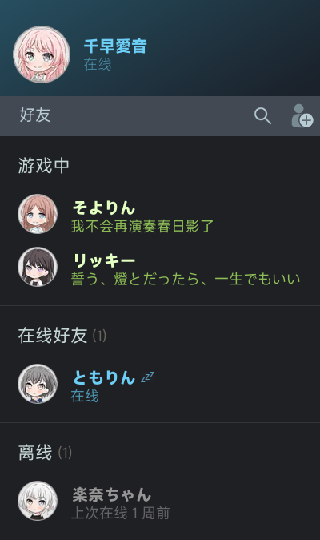

# Nonebot-Plugin-Steam-Info
✨ Steam 好友状态播报 NoneBot 插件 ✨

## 功能
- [x] 绑定 Steam ID
- [x] 群友状态变更播报
- [x] 群友游戏时间播报
- [x] 主动查询群友状态

## 预览
仿照了 Steam 好友列表的样式

## 使用
| 命令 | 别名 |  说明 |
| --- | --- | --- |
| steambind [Steam ID 或 Steam好友代码] | 绑定steam | 绑定 Steam |
| steamunbind | 解绑steam | 解绑 Steam |
| steaminfo | steam信息 | 查看绑定信息 |
| steamcheck | 查看steam, 查steam | 查询群友 Steam 状态 |
| steamupdate [名称] [图片] | 更新群信息 | 更新群聊头像和名称 |
| steamenable | 启用steam | 启用群友状态播报 |
| steamdisable | 禁用steam | 禁用群友状态播报 |
| steamnickname [昵称] | steam昵称 | 设置 Steam 玩家昵称，用于辨识 Steam 名称与群昵称不一致的群友 |

> 记得加上你配置的命令头哦

## 安装方法

使用 nb-cli 安装

在 nonebot2 项目的根目录下打开命令行, 输入以下指令即可安装

    nb plugin install nonebot-plugin-steam-info

使用包管理器安装

在 nonebot2 项目的插件目录下, 打开命令行, 根据你使用的包管理器, 输入相应的安装命令

pip

    pip install nonebot-plugin-steam-info

pdm

    pdm add nonebot-plugin-steam-info

poetry

    poetry add nonebot-plugin-steam-info

conda

    conda install nonebot-plugin-steam-info

打开 nonebot2 项目根目录下的 `pyproject.toml` 文件, 在 `[tool.nonebot]` 部分追加写入

    plugins = ["nonebot_plugin_steam_info"]

## 配置
在 .env 文件中配置以下内容

| 配置项 | 默认值 | 说明 |
| --- | --- | --- |
| STEAM_API_KEY | 无 | Steam API Key，可以是一个字符串，也可以是一列表的字符串，即支持多个API Key，在 [此处](https://partner.steamgames.com/doc/webapi_overview/auth) 获取 |
| PROXY | 无 | 代理地址 |
| STEAM_REQUEST_INTERVAL | 300 | Steam 请求间隔 & 播报间隔。单位为秒 |
| STEAM_BROADCAST_TYPE | `"part"` | 播报类型。`"part"` 为部分播报(图 2)，`"all"` 为全部播报(图 1)，`"none"` 为只播报文字消息 |
| STEAM_DISABLE_BROADCAST_ON_STARTUP | `False` | Bot 启动时是否禁用播报 |

最后再把仓库中 `fonts` 文件夹下的字体文件放到 Bot 的 **运行目录** 下，配置就完毕啦

> 这里使用了 MiSans 字体，感谢 [MiSans](https://hyperos.mi.com/font/zh/)

>如果你希望使用其他字体，请在 `draw.py` 中，将 `font_regular_path`, `font_light_path` 和 `font_bold_path` 修改为你的字体文件路径
